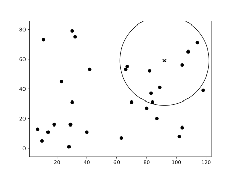
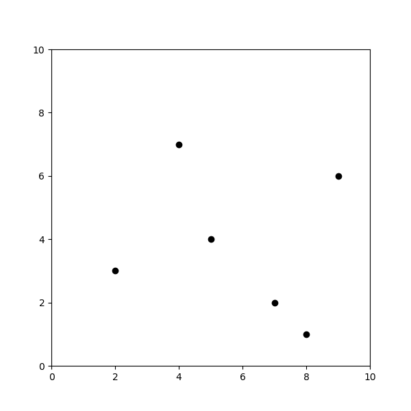
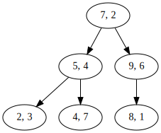
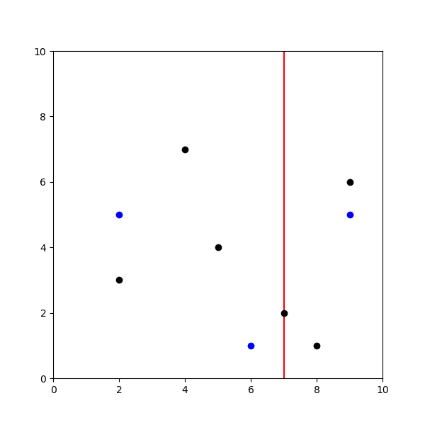
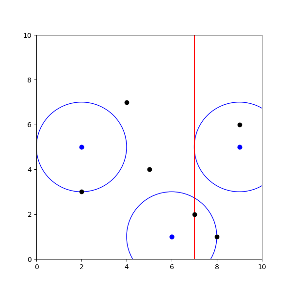
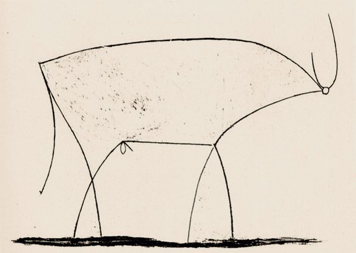
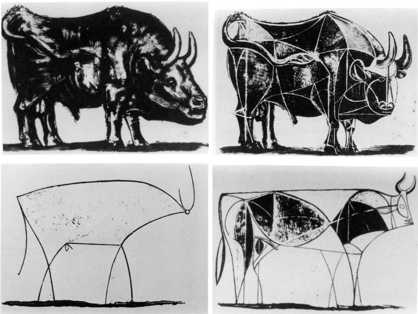
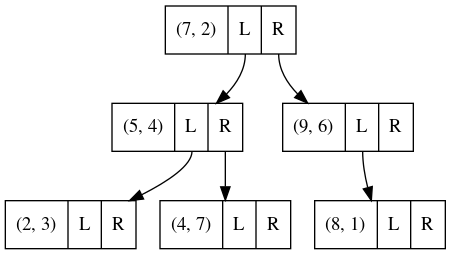
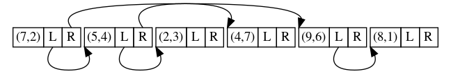
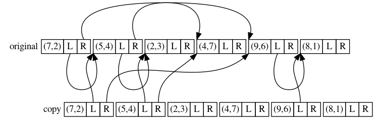

# What is in this talk

---

My k-d tree journey

---

Why the odd title?

. . .

>- Fairy tales are told and re-told
>- Vehicle for teaching & learning
>- Familiar form makes room for play
>- Transcend time and place

---

Disclaimers

. . .

>- Some code has been modified to fit on slides
>- Some bad puns
>- Spoiler alert

# Little Red Riding Hood

---

\center
{ height=80\% }

---

\center
{ height=80\% }

---

\center
{ height=80\% }

---

\center
{ height=80\% }

---

The collapse of the Taiping Rebellion and my subsequent wanderings to avoid the
deadly clutches of vengeful imperial agents form the basis of this narrative, a
narrative whose very existence and use of the first person pretty much ruin any
sense of suspense that might have made it worth reading.

. . .

Drew Herman, Port Angeles, WA

https://www.bulwer-lytton.com/2021

# \fontsize{80pt}{86pt}木

---

Given a set **P** of points with a value (x, y, v) and a radius **R**

what is the averge value of the points within **R** of **p** for every **p** in
**P**.

---

\center
{ width=80% }

Average value in the circle?

---

```{.python}
for q in points:
    if distance(p, q) <= radius:
        close.append(q)
return mean(close)
```

---

```{.python}
for p in points:
    close = []
    for q in points:
        if distance(p, q) <= radius:
            close.append(q)
    yield mean(close)
```

. . .

Performance? Complexity?

. . .

O(n²)

---

\center
{ height=80\% }

## k-d tree

The k-d tree is a binary tree in which every node is a k-dimensional point.

. . .

Every non-leaf node can be thought of as implicitly generating a splitting
hyperplane that divides the space into two parts, known as half-spaces.

---

Points to the left of this hyperplane are represented by the left subtree of
that node and points to the right of the hyperplane are represented by the
right subtree.

. . .

The hyperplane direction is chosen in the following way: every node in the tree
is associated with one of the k dimensions, with the hyperplane perpendicular
to that dimension's axis.

. . .

Source: [wikipedia.org/wiki/kd_tree](https://en.wikipedia.org/wiki/Kd_tree)

---

A monad is a monoid in the category of endofunctors, what's the problem?

---

## Features

* Space partitioning
* Nearest neighbour search
* Range searches
* Database search by multiple keys
    + Example: salary & age

# Inventing the k-d tree

---

    template < typename Point >
    struct kdtree {
        kdtree() = default;

        template < typename PointItr >
        kdtree(PointItr, PointItr, int depth = 0);

        Point p;
        std::unique_ptr< kdtree > left;
        std::unique_ptr< kdtree > right;
    };

---

    template < typename Point, typename Radius >
    bool inrange(const Point& p, const Point& q, Radius r) noexcept {
        const auto x0 = q[0] - p[0];
        const auto x1 = q[1] - p[1];
        return x0*x0 + x1*x1 <= r*r;
    }

---

Construction algorithm

    function kdtree ([Point] points, int depth) {
        // Select axis based on depth
        var int axis := depth mod k;

        select median by axis from pointList;

        // Create node and construct subtree
        node.location := median;
        node.left     := kdtree(points < median, depth+1);
        node.right    := kdtree(points > median, depth+1);
        return node;
    }

---

    kdtree::kdtree(PointItr fst, PointItr lst, int depth) {
        const auto axis = depth % 2;
        auto less = [axis](const auto& l, const auto& r) noexcept {
            return l[axis] < r[axis];
        };
        std::sort(fst, lst, less);
        const auto midpoint = std::distance(fst, lst) / 2;
        const auto mid  = std::next(fst, midpoint);
        const auto mid1 = std::next(mid);
        this->p = *mid;

        if (fst != mid)
            this->left = std::make_unique(fst, mid, depth + 1);
        if (mid1 != lst)
            this->right = std::make_unique(mid1, lst, depth + 1);
    }

---

Nearest neighbour search

```
NNS(q: point, n: node, p: ref point, w: ref distance):
if leaf(n):
    W := ||q - n.point||
    if W < w then w := W; p := n.point
else:
    if q(n.axis) <= n.value:
        search_first := left
    else:
        search_first := right

    if search_first == left:
        if q(n.axis) - w <= n.value then NSS(q, n.left,  p, w)
        if q(n.axis) + w >  n.value then NSS(q, n.right, p, w)
    else:
        if q(n.axis) + w >  n.value then NSS(q, n.right, p, w)
        if q(n.axis) - w <= n.value then NSS(q, n.left,  p, w)
```

---

Nodes in radius search

    NRS(q: point, n: node, p: ref point, r: radius):
    W := ||q - n.point||
    if W < r then yield n

    if not leaf(n):
        if q(n.axis) <= n.value:
            search_first := left
        else:
            search_first := right

        if search_first == left:
            if q(n.axis) - w <= n.value then NRS(q, n.left,  p, w)
            if q(n.axis) + w >  n.value then NRS(q, n.right, p, w)
        else:
            if q(n.axis) + w >  n.value then NRS(q, n.right, p, w)
            if q(n.axis) - w <= n.value then NRS(q, n.left,  p, w)

---

Two decisions:

* Include the node or not
* Walk a subtree or not

---

::: columns

:::: column
\center

::::

:::: column
\center
{ width=100% }
::::

:::

---

::: columns

:::: column
\center
{ width=100% }
::::

:::: column
\center
{ width=100% }
::::

:::

---

\center
{ width=80% }

---

\center
{ width=80% }

---

Neighbours-in-range

    OutItr query(Point& p, double r, InItr node, int depth, OutItr out) {
        const auto& q    = *node->p;
        const auto left  = node.left.get();
        const auto right = node.right.get();
        const auto axis  = depth % 2;

        if (inrange(p, q, r))
            *out++ = q;

        if (p[axis] - r <= q[axis] && left)
            out = query(p, r, left,  depth + 1, out);
        if (p[axis] + r >= q[axis] && right)
            out = query(p, r, right, depth + 1, out);

        return out;
    }


# Effective abstractions

---

\center
{ width=80\% }

---

```
class kdtree::view {
public:
    explicit view(const kdtree* node) : n(node) {}

    const Point& operator * () const noexcept (true) {
        return this->n->p;
    }
    view left() const noexcept (true) {
        return view(this->n->left.get());
    }
    view right() const noexcept (true) {
        return view(this->n->right.get());
    }
    operator bool () const noexcept (true) {
        return bool(this->n);
    }

private:
    const kdtree* n;
};
```

---

\center
{ height=80\% }

. . .

Pointer in a top hat

---

\center
{ height=80\% }

---

\center
{ width=80\% }

---

```
OutItr query(Point& p, double r, InItr node, int depth, OutItr out) {
    const auto& q    = *node;
    const auto left  = node.left();
    const auto right = node.right();
    const auto axis  = depth % 2;

    if (inrange(p, q, r))
        *out++ = q;

    if (p[axis] - r <= q[axis] && left)
        out = query(p, r, left,  depth + 1, out);
    if (p[axis] + r >= q[axis] && right)
        out = query(p, r, right, depth + 1, out);

    return out;
}
```

---

```
OutItr query(Point& p, double r, InItr node, OutItr out) {
    const auto& q    = *node;
    const auto left  = node.left();
    const auto right = node.right();
    const auto axis  = node.depth() % 2;

    if (inrange(p, q, r))
        *out++ = q;

    if (p[axis] - r <= q[axis] && left)
        out = query(p, r, left,  out);
    if (p[axis] + r >= q[axis] && right)
        out = query(p, r, right, out);

    return out;
}
```

---

```
OutItr query(Point& p, double r, InItr node, OutItr out) {
    const auto& q    = *node;
    const auto left  = node.left();
    const auto right = node.right();
    const auto axis  = node.axis()

    if (inrange(p, q, r))
        *out++ = q;

    if (p[axis] - r <= q[axis] && left)
        out = query(p, r, left,  out);
    if (p[axis] + r >= q[axis] && right)
        out = query(p, r, right, out);

    return out;
}
```

---

Easier to use

* Impossible to forget incrementing depth
* Familiar "iterators"
* No raw numbers, manual increments


. . .

Models tree properties

* Left/right subtree
* Captures depth
* Captures leaf

# Representation

---

    template < typename Point >
    struct kdtree {
        kdtree() = default;

        template < typename PointItr >
        kdtree(PointItr, PointItr, int depth = 0);

        Point p;
        std::unique_ptr< kdtree > left;
        std::unique_ptr< kdtree > right;
    };

---

* Pointer-based trees support fast splicing
    + but splicing likely invalidates invariant
    + splicing gives lifetime issues
* Tree merges not very common
    + full rebuilds faster without pointer chasing
* Bad usability, bad performance
* Nodes treated as independent, not part of _collection_

---

    template < typename Point >
    class kdtree {
        Point p;
        kdtree* left  = nullptr;
        kdtree* right = nullptr;
        std::unique_ptr< kdtree[] > storage;
    };

---

    template < typename Point >
    class kdtree {
        struct node {
            Point p;
            node* left  = nullptr;
            node* right = nullptr;
        };
        std::unique_ptr< node[] > storage;
    };

---

In all the fairy tales, things come in threes

---

We want the tree to be:

* Default constructible
* Copy constructible
* Move constructible

---

✓ Default constructible

✗ Copy constructible

✓ Move constructible

---

## The rule of three

If a class requires a user-defined destructor, a user-defined copy constructor,
or a user-defined copy assignment operator, it almost certainly requires all
three.

---

    kdtree(const kdtree& o) {
        const auto n = count_nodes(o);
        this->storage.reset(new kdtree[n]);
        std::copy_n(o.storage.get(), n, this->storage.get());
    }

. . .

oops

---

\center
{ width=80% }

---

\center
{ width=80% }

---

\center
{ width=80% }

---

```
kdtree(const kdtree& o) {
    const auto n = count_nodes(o);
    this->storage.reset(new kdtree[n]);
    std::copy_n(o.storage.get(), n, this->storage.get());

    auto* src0 = o.storage.get();
    auto* dst0 = this->storage.get();
    for (int i = 0; i < n; ++i) {
        auto& dst = this->storage[i];
        const auto& src = o.storage[i];
        dst.p = src->p;

        if (src.left)  dst.left  = dst0 + distance(src0, src.left);
        if (src.right) dst.right = dst0 + distance(src0, src.right);
    }
}
```

---

What about assignment and destructor?

[...] it *almost certainly* requires all three.


## The rule of zero

Classes that have custom destructors, copy/move constructors or copy/move
assignment operators should deal exclusively with ownership

---

Remember this from the 90s

    template < Point >
    class kdtree : public binarytree< Point >

---

    class kdtree {
        struct node {
            Point p;
            node* left  = nullptr;
            node* right = nullptr;
        };
        tree_storage< node > storage;
    };

---

    template < typename Node >
    class tree_storage {
    public:
        tree_storage() = default;
        tree_storage(std::size_t n) : storage(n) {}
        tree_storage(const tree_storage& o);

        const Node* get() const noexcept;
              Node* get()       noexcept;

    private:
        std::vector< Node > storage;
    };

# On pointers

---

\center
{ width=80% }

---


The essence of a pointer

* Absolute address
* Arithmetic support
* Carries type information
* Can be marked “unset” (nullptr)

. . .

What do we really use?

---

\center
{ width=80% }

```
storage = [(7,2) (5,4) (2,3) (4,7) (9,6) (8,1)]
left    = [  1     2    -1    -1     5    -1  ]
right   = [  4     3    -1    -1    -1    -1  ]
```

---

```
class kdtree {
private:
    std::vector< int >   left;
    std::vector< int >   right;
    std::vector< Point > storage;
};
```

. . .

* Relocatable
* Cheap to copy
* Easy to serialize

---

    view left() const noexcept (true) {
        // follow edges by looking up left[pos]
        // and maintain pos as the tree is descended
        const auto k = this->tree->left[this->pos];
        return view(this->tree, k, this->d + 1);
    }

---

    template < typename Point >
    class kdtree {
    public:
        template < typename PointItr >
        kdtree(PointItr, PointItr);

        kdtree()              = default;
        kdtree(const kdtree&) = default;
        kdtree(kdtree&&)      = default;

    private:
        std::vector< int >   left;
        std::vector< int >   right;
        std::vector< Point > storage;
    };

---

✓ Default constructible

✓ Copy constructible

✓ Move constructible

# Gazing into the abyss

---

Abstraction does not stop at the class boundary

---

    // old
    const auto axis = depth % 2;
    const auto less = [axis](const auto& l, const auto& r) noexcept {
        return l[axis] < r[axis];
    };

    std::sort(fst, lst, less);
    const auto midpoint = std::distance(fst, lst) / 2;
    const auto mid = std::next(fst, midpoint);


    // new
    const auto pivot = this->select_pivot(fst, lst, depth);
    const auto mid   = this->partition_inplace(fst, lst, pivot);

---

    const auto pivot = this->select_pivot(fst, lst, depth);
    const auto mid   = this->partition_inplace(fst, lst, pivot, depth);
    this->storage[pos] = *mid;
    auto out = pos + 1;

    if (fst != mid) {
        this->left[pos] = out;
        out = this->init(fst, mid, depth + 1, out);
    }
    const auto mid1 = std::next(mid);
    if (mid1 != lst) {
        this->right[pos] = out;
        out = this->init(mid1, lst, depth + 1, out);
    }
    return out;

---

    PointItr select_pivot(PointItr fst, PointItr lst, int depth)
    noexcept {
        struct less {
            int axis;
            constexpr explicit less(int a) : axis(a) {}
            constexpr bool operator () (const P& lhs, const P& rhs)
            const noexcept {
                return lhs[axis] < rhs[axis];
            }
        };
        using indices = std::make_index_sequence< 2 >;
        constexpr static auto cmps = init_less< less >(indices {});
        std::sort(fst, lst, cmps[depth % 2]);
        return std::next(fst, std::distance(fst, lst) / 2);
    }

---

    template < typename Less, std::size_t... I >
    constexpr auto init_less(std::index_sequence< I... >) {
        return std::array { Less(I)...  };
    }

---

\center
{ width=80% }

---

    template < std::size_t Axis, typename Itr >
    Itr kdtree::select_pivot(Itr fst, Itr lst) noexcept {
        auto less = [](const auto& lhs, const auto& rhs) noexcept {
            return lhs[Axis] < rhs[Axis];
        };

        std::sort(fst, lst, less);
        return std::next(fst, std::distance(fst, lst) / 2);
    }

---

```
template < typename Point >
struct median_strategy {
    template< typename Itr >
    Itr select_pivot(Itr fst, Itr lst, int depth) const noexcept {
        const auto axis = depth % 2;
        const auto less = [axis](const auto& lhs, const auto& rhs) noexcept {
            return lhs[axis] < rhs[axis];
        };

        auto pivot = std::next(fst, std::distance(fst, lst) / 2);
        std::nth_element(fst, pivot, lst, less);
        return pivot;
    }

    template < typename Itr >
    Itr partition_inplace(Itr fst, Itr lst, Itr pivot, int depth) const noexcept {
        const auto axis  = depth % 2;
        const auto limit = (*pivot)[axis];
        const auto less  = [axis, limit](const auto& x) noexcept {
            return x[axis] < limit;
        };
        return std::partition(fst, lst, less);
    }
};
```

```
    const auto pivot = this->strat.select_pivot(fst, lst, depth);
    const auto mid   = this->strat.partition_inplace(fst, lst, pivot, depth);
    this->storage[pos] = *mid;
    auto out = pos + 1;
```

---

\center
{ width=80% }

---

Fun experiments:

* Implicit edge representations
* More search algorithms
* Interesting pivot selections


---

As Granny sewed the bloody wolf pelt onto the stained red cape, Little Red
downed another shot, reminding herself that even alcohol has a better taste
than the gastric acid of a wolf.

. . .

Thank you
